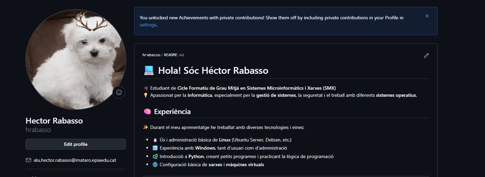
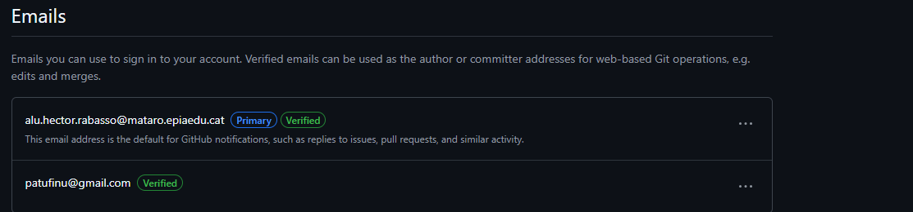
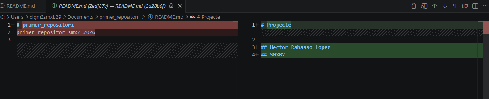
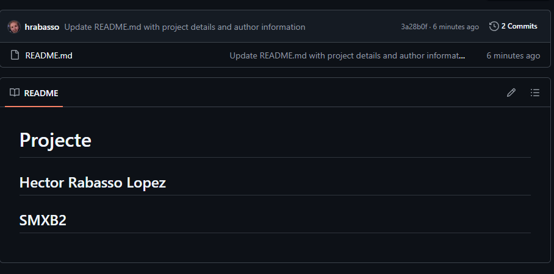

# Activitat 1. El primer repositori: GitHub i Visual Studio Code

## Evidències

### 1. Perfil de GitHub

En aquesta captura es mostra el nostre perfil de GitHub.

### 2. Correus electrònics

En aquesta captura es mostra l'apartat **Settings > Emails**, on apareixen els correus afegits i verificats.

### 3. Repositori creat

En aquesta captura es mostra el repositori `primer_repositori` creat a GitHub.

### 4. Canvi realitzat al repositori

En aquesta captura es mostra el `README.md` amb la informació afegida i el canvi publicat al repositori.

## Enllaç al repositori

[Repositori primer_repositori](https://github.com/hrabasso/primer_repositori-.git)
